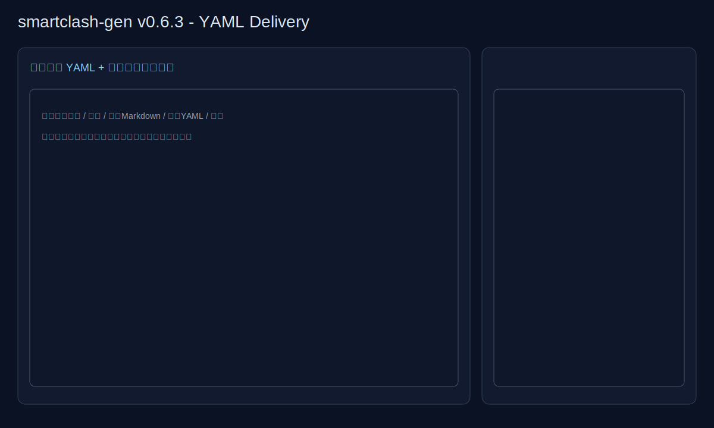

# smartclash-gen

> 版本：**v0.6.3**

一个面向 **OpenClash + mihomo(type: smart)** 的配置生成器：

- 输入常用节点 URL（`vless://`、`vmess://`、`trojan://`、`ss://`），一行一条
- 自动生成可编辑 `.yaml`
- 自动输出 Markdown 版 YAML（代码块）
- 输入 `rul/rules`（一行一条）后，自动转为 YAML 规则并注入 Smart 策略组
- 内置默认 `rule-providers`（ACL4SSR + blackmatrix7 + MetaCubeX）
- 生成 `type: smart` 策略组，支持正则优先级、自动分区（HK/SG/JP）

---

## 安装后应用示意图



---

## 一键安装（支持自定义端口）

> 默认端口 `7892`，可通过 `-p` 自定义。

```bash
bash -c "$(curl -fsSL https://raw.githubusercontent.com/cshaizhihao/smartclash-gen/main/install.sh)" -- -p 10801
```

---

## 输入文件格式

### 1) URL 文件（`urls.txt`）

```text
vless://uuid@host:443?type=ws&security=tls&sni=example.com&path=%2Fws#HK-01
vmess://xxxxx(base64)
trojan://password@host:443?sni=example.com#SG-01
ss://xxxxx#JP-01
```

### 2) 规则文件（`rules.txt` 或 `rul.txt`）

```text
DOMAIN-SUFFIX,google.com,Smart-AUTO
DOMAIN-KEYWORD,openai,Smart-SG
IP-CIDR,8.8.8.8/32,Smart-JP,no-resolve
MATCH,Smart-AUTO
```

> 若只写两段，如 `DOMAIN-SUFFIX,google.com`，默认补策略组为 `Smart-AUTO`。

---

## 生成命令

### 方式 A：本地 urls.txt

```bash
python3 generate.py --urls urls.txt --rules rules.txt --port 10801 --output openclash.yaml
```

### 方式 B：订阅 URL 自动拉取（新增）

```bash
python3 generate.py \
  --sub-url "https://example.com/sub1" \
  --sub-url "https://example.com/sub2" \
  --rules rules.txt \
  --port 10801 \
  --output openclash.yaml
```

### 方式 C：订阅列表文件（每行一个订阅 URL）

```bash
python3 generate.py --sub-file subscriptions.txt --rules rules.txt --port 10801 --output openclash.yaml
```

生成结果：

- `openclash.yaml`（可直接编辑）
- `openclash.md`（Markdown 代码块版 YAML）
- `report.json`（输入校验/告警报告）

可指定报告输出路径：

```bash
python3 generate.py --urls urls.txt --rules rules.txt --report build/report.json
```

### OpenClash 直接落地（新增）

支持将生成结果直接部署到目标路径，并自动备份旧文件：

```bash
python3 generate.py \
  --sub-file subscriptions.txt \
  --rules rules.txt \
  --port 7892 \
  --output openclash.yaml \
  --deploy /etc/openclash/config/custom.yaml \
  --backup-dir /etc/openclash/config/backups
```

---

## 默认生成能力

- 全局基础项（含你给定默认值）：
  - `mixed-port`（可自定义）
  - `external-controller: ':9090'`
  - `ipv6: false`
  - `keep-alive-interval: 15`
  - `tcp-concurrent: true`
  - `unified-delay: true`
  - `dns.enhanced-mode: redir-host`

- `rule-providers` 默认内置：
  - BanAD / BanProgramAD / ChinaCompanyIp / ChinaDomain / GoogleCN / LocalAreaNetwork / ProxyLite / ProxyMedia / SteamCN / Telegram / UnBan
  - Netflix / Gemini
  - openai / category-ai-!cn

- `proxy-groups`：
  - `Smart-AUTO`（`type: smart`）
  - `Smart-HK` / `Smart-SG` / `Smart-JP`
  - `DIRECT`

---

## 版本更新说明

### v0.6.3
- 新增 `下载 YAML` 按钮，可直接导出 `smartclash-config.yaml`
- 发布失败状态优化：显示阻塞原因摘要（前两条）以便快速修复
- 与现有流程保持一致：页面编辑 → 保存 → 复制/下载 → 发布
- README 版本号、变更说明与截图同步到 v0.6.3

### v0.6.2
- 规则模块新增 `mixed-port` 输入框，生成 YAML 时支持页面内端口自定义
- 新增端口校验：端口非 1-65535 整数时，阻塞发布
- 新增 `下载 Markdown` 按钮，支持直接导出 `.md` 文件
- 新增本地状态持久化（localStorage）：刷新后保留节点/策略组/规则/端口
- README 版本号、变更说明与截图同步到 v0.6.2

### v0.6.1
- 新增“发布配置”按钮，建立发布前校验关口
- 实现“告警不阻塞编辑，但阻塞发布”机制
- 发布阻塞条件：Smart 组为空、无效节点引用、规则格式错误、规则引用不存在策略组
- 新增发布状态提示（尚未发布 / 发布失败 / 发布成功）
- README 版本号、变更说明与截图同步到 v0.6.1

### v0.6.0
- 新增 `web/` 页面交互原型（模块化编辑 + 拖拽排序 + 保存生成 Markdown）
- 新增节点池、策略组、规则三大模块化编辑区
- 新增策略组排序、组内节点排序、节点跨组迁移（拖拽）
- 新增右侧固定 Markdown 预览区，支持直接编辑
- 新增一键复制 Markdown
- 新增一致性告警（Smart 组空成员、无效节点引用、疑似无效规则行）
- README 版本号、变更说明与截图同步到 v0.6.0

### v0.5.0
- 新增 `--deploy`：生成后可直接部署到目标 YAML 路径
- 新增 `--backup-dir`：部署前自动备份旧配置
- 报告中新增 deploy 执行结果字段
- README 新增 OpenClash 直接落地用法
- README 附本次更新后的应用截图（v0.5.0）

### v0.4.0
- 增加输入校验报告：`report.json`
- 增加 URL 解析失败清单、规则格式错误清单
- 增加重复 URL 去重统计与告警
- 增加输出 YAML 自检（结构/Smart 组空组校验）
- 增加标准退出码：`0=成功`、`10=成功但有告警`、`1=失败`
- README 与示意图版本同步更新

### v0.3.0
- 新增 `--sub-url`：支持直接拉取订阅链接并自动解析
- 新增 `--sub-file`：支持订阅链接列表批量导入
- 自动识别订阅内容（明文/整段Base64）并转为节点列表
- README 更新版本号与示意图版本

### v0.2.0
- 增加默认 `rule-providers`
- 增加规则行转 YAML 规则结构注入
- 增加 Smart 分组自动分类
- README 增加版本号与安装后应用示意图

### v0.1.0
- 首个可用版本：URL -> YAML / Markdown YAML

---

## 免责声明

本项目仅用于网络配置自动化与学习交流，请在遵守当地法律法规和服务条款前提下使用。
