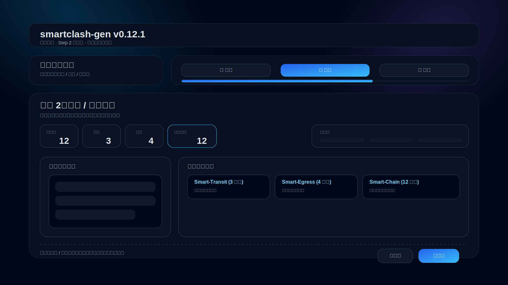

# smartclash-gen

> 版本：**v0.12.1**

一个面向 **OpenClash + mihomo(type: smart)** 的配置生成器：

- 输入常用节点 URL（`vless://`、`vmess://`、`trojan://`、`ss://`），一行一条
- 自动生成可编辑 `.yaml`
- 自动输出 Markdown 版 YAML（代码块）
- 输入 `rul/rules`（一行一条）后，自动转为 YAML 规则并注入 Smart 策略组
- 内置默认 `rule-providers`（ACL4SSR + blackmatrix7 + MetaCubeX）
- 生成 `type: smart` 策略组，支持正则优先级、自动分区（HK/SG/JP）

---

## 安装后应用示意图



---

## 在线访问（本次部署）

- 访问地址：**http://smart.zze.cc**

## 一键安装（支持自定义端口）

> 默认端口 `7892`，可通过 `-p` 自定义。

```bash
bash -c "$(curl -fsSL https://raw.githubusercontent.com/cshaizhihao/smartclash-gen/main/install.sh)" -- -p 10801
```

### 启动 Web 工作台（支持网页一键更新）

```bash
cd smartclash-gen/web
python3 dev_server.py
```

> 使用 `dev_server.py` 启动时，页面内的“网页一键更新”按钮可直接生效。

---

## 输入文件格式

### 1) URL 文件（`urls.txt`）

```text
vless://uuid@host:443?type=ws&security=tls&sni=example.com&path=%2Fws#HK-01
vmess://xxxxx(base64)
trojan://password@host:443?sni=example.com#SG-01
ss://xxxxx#JP-01
```

### 2) 规则文件（`rules.txt` 或 `rul.txt`）

```text
DOMAIN-SUFFIX,google.com,Smart-AUTO
DOMAIN-KEYWORD,openai,Smart-SG
IP-CIDR,8.8.8.8/32,Smart-JP,no-resolve
MATCH,Smart-AUTO
```

> 若只写两段，如 `DOMAIN-SUFFIX,google.com`，默认补策略组为 `Smart-AUTO`。

---

## 生成命令

### 方式 A：本地 urls.txt

```bash
python3 generate.py --urls urls.txt --rules rules.txt --port 10801 --output openclash.yaml
```

### 方式 B：订阅 URL 自动拉取（新增）

```bash
python3 generate.py \
  --sub-url "https://example.com/sub1" \
  --sub-url "https://example.com/sub2" \
  --rules rules.txt \
  --port 10801 \
  --output openclash.yaml
```

### 方式 C：订阅列表文件（每行一个订阅 URL）

```bash
python3 generate.py --sub-file subscriptions.txt --rules rules.txt --port 10801 --output openclash.yaml
```

生成结果：

- `openclash.yaml`（可直接编辑）
- `openclash.md`（Markdown 代码块版 YAML）
- `report.json`（输入校验/告警报告）

可指定报告输出路径：

```bash
python3 generate.py --urls urls.txt --rules rules.txt --report build/report.json
```

### OpenClash 直接落地（新增）

支持将生成结果直接部署到目标路径，并自动备份旧文件：

```bash
python3 generate.py \
  --sub-file subscriptions.txt \
  --rules rules.txt \
  --port 7892 \
  --output openclash.yaml \
  --deploy /etc/openclash/config/custom.yaml \
  --backup-dir /etc/openclash/config/backups
```

---

## 默认生成能力

- 全局基础项（含你给定默认值）：
  - `mixed-port`（可自定义）
  - `external-controller: ':9090'`
  - `ipv6: false`
  - `keep-alive-interval: 15`
  - `tcp-concurrent: true`
  - `unified-delay: true`
  - `dns.enhanced-mode: redir-host`

- `rule-providers` 默认内置：
  - BanAD / BanProgramAD / ChinaCompanyIp / ChinaDomain / GoogleCN / LocalAreaNetwork / ProxyLite / ProxyMedia / SteamCN / Telegram / UnBan
  - Netflix / Gemini
  - openai / category-ai-!cn

- `proxy-groups`：
  - `Smart-AUTO`（`type: smart`）
  - `Smart-HK` / `Smart-SG` / `Smart-JP`
  - `DIRECT`

---

## 版本更新说明

### v0.12.1
- 在 Step 2 编排页补上主工作区状态条：未分配 / 中转 / 落地 / 链式结果 数量实时可见，减少“拖完后还要自己脑补状态”的成本
- 策略组标题增加节点计数，让每个组的密度和承载情况一眼可读
- Step 2 头部与命名区布局继续收敛，强化“当前只做编排”这一焦点感
- 保持单页行进式 Flow 不变，在现有路线下继续做产品级收口

### v0.12.0
- 纠正上一轮“三栏摊平工作台”路线，重构为真正的单页行进式 Flow：始终一个舞台、一次只聚焦当前步骤
- 三步主链改为独立 Stage 卡片：Step 1 导入 / Step 2 编排 / Step 3 发布，在同页内完成横向滑入 + 淡入过渡
- 每步底部补齐明确主按钮与返回动作：导入页主推“下一步”，编排页主推进入发布，发布页支持返回编排或回到导入
- 顶部步骤条恢复成轻量进度反馈，新增 `Step x / 3` 文本状态，减少“像文档页面一样往下读”的误解
- 页面结构、前端缓存键、版本号、预览截图统一升级到 v0.12.0

### v0.11.0
- 主流程重构为三栏工作台：左侧导入与节点池 / 中间编排 / 右侧输出发布
- 三步流程从“切页模式”改为“工作台同屏模式”，减少来回跳转与点击成本
- 导入成功后自动推进到编排区，不再要求用户连续点击多个“下一步”
- 顶部步骤条改为状态导航，保留快速定位但不再承担主要操作流
- 版本号与前端缓存参数同步到 v0.11.0

### v0.10.6
- 继续收紧顶部向导样式：彻底去背景、去边框、去卡片化，只保留按钮与进度信息
- 节点拖拽区优化为“优先组前置”渲染：中转组 / 落地组 / 链式组 / Smart-AUTO 优先显示，减少找组成本
- 节点池与组容器视觉细化，卡片密度更高，拖拽区更接近实际工作台
- 版本号与前端缓存参数同步到 v0.10.6

### v0.10.5
- 顶部向导区域改为纯透明容器，彻底移除黑色大边框视觉块
- 移除默认示例节点 `HK-01/SG-01/JP-01`，初始节点列表改为空
- 节点编辑新增“删除当前节点”按钮（删除后自动从所有策略组成员中清理）
- 前端缓存版本升级到 v0.10.5，确保样式与交互生效

### v0.10.4
- 自查定位到样式覆盖顺序问题：`.panel` 在后定义，覆盖了 `.nav-panel` 的去边框设置，导致“黑色大边框”看起来无改动
- 增加 `.panel.nav-panel` 强覆盖规则（透明背景/无边框/无阴影），彻底移除顶部向导外层厚重黑框
- 前端版本号与缓存参数同步到 v0.10.4

### v0.10.3
- 修复顶部向导“黑色大边框/空块感”：将外层 panel 改为透明容器，实际内容放入紧凑 `nav-shell`
- 收敛向导区视觉边界，移除整块厚重暗边，顶部卡片高度更贴合内容
- 版本号与前端缓存参数同步到 v0.10.3

### v0.10.2
- 修复导入页反馈弱的问题：批量导入时增加“处理中”状态与下一步引导文案
- 导入完成后支持“直接进入第 2 步”按钮，减少用户困惑
- 替换“新手模式”卡片为“智能流程建议”，文案更现代、信息更聚焦
- 优化顶部向导区间距与视觉边框，减少空白边缘的割裂感
- 版本号与前端缓存参数同步到 v0.10.2

### v0.10.1
- UI 重构为“单屏三步向导”布局：导入 → 编排 → 发布，减少多级 tab 的割裂感
- 顶部新增三步进度按钮，可一键跳转到目标阶段
- 导航视觉升级：统一步骤条样式，弱化后台感，聚焦任务流
- 版本升级到 v0.10.1，并强制刷新前端脚本参数

### v0.10.0
- 节点导入新增“机场订阅链接”输入区：支持每行一个订阅 URL
- 新增“拉取订阅并填充节点”按钮：自动请求订阅内容并提取全部节点 URL
- 订阅拉取支持 Base64 订阅内容自动解码（常见机场格式）
- `web/dev_server.py` 新增 `/api/subscriptions/fetch` 接口，前端可直接拉取并导入
- README 版本号与截图引用同步到 v0.10.0

### v0.9.3
- 彻底关闭登录门禁展示：`authGate` 默认隐藏，避免页面初始仍出现密码框
- `app.js` 引用追加版本参数（`?v=0.9.3`），强制浏览器拉取新脚本，规避缓存导致的旧登录逻辑残留
- README 版本号与截图引用同步到 v0.9.3

### v0.9.2
- 链式代理逻辑改为“拖拽分组驱动”：不再依赖节点名关键词
- 你将节点拖入「中转组」「落地组」后，自动生成 relay 链路并汇总到链式组
- 自动补齐三类组（中转/落地/链式），导入后可直接拖拽使用
- 发布前校验新增链式激活提示：若两组为空会给出明确引导
- README 版本号与截图引用同步到 v0.9.2

### v0.9.1
- 新增“中转组 / 落地组 / 链式组”自定义命名输入
- 自动识别节点名中的关键词并分组：
  - 中转关键词：`relay/transit/中转/入口/entry`
  - 落地关键词：`egress/exit/landing/落地/出口`
- 当中转与落地节点同时存在时，自动生成链式代理：
  - `<链式组名>-1..N`（`type: relay`，按“中转→落地”链路）
  - `<链式组名>`（`type: select`，聚合所有链路）
- 暂时关闭登录门禁，打开页面可直接验收
- README 版本号与截图引用同步到 v0.9.1

### v0.9.0
- 修复 `web/app.js` 的 ID 生成逻辑：在支持 `crypto.randomUUID` 的浏览器中不再递归调用导致潜在栈溢出
- Web 端版本号与存储 key 同步升级到 v0.9.0，避免历史状态与新逻辑混淆
- README 新增在线访问地址，便于每轮推送后直接验收
- README 版本号与截图引用同步到 v0.9.0

### v0.8.9
- 更新体验再简化：新增“一键检查并更新”主按钮，减少操作步骤
- 自动流程：先检查版本，若有新版本则直接执行网页更新
- 保留“仅检查更新 / 复制命令”作为备用入口
- README 版本号与截图引用同步到 v0.8.9

### v0.8.8
- 新增网页“一键更新”能力：在更新助手中可直接触发更新，无需手动复制终端命令
- 新增 `web/dev_server.py`：提供 `/api/version` 与 `/api/update` 接口（支撑网页内检查/更新）
- 保留“复制更新命令”作为兜底方案
- README 版本号与截图引用同步到 v0.8.8

### v0.8.7
- 新增“更新助手”：支持一键检查远端版本、复制更新命令
- 新增 `VERSION` 文件，作为 Web 与安装脚本统一版本源
- `install.sh` 新增 `--update` 模式，可原地快速更新已安装目录
- README 版本号与截图引用同步到 v0.8.7

### v0.8.6
- 登录界面体验优化：按钮文案改为“开始使用/登录”，减少理解门槛
- 登录提示自动识别“首次使用 vs 已创建账号”，给出更直白引导
- 密码输入新增“显示/隐藏”开关，降低输错概率
- 支持回车直接提交登录，减少点击操作
- README 版本号与截图引用同步到 v0.8.6

### v0.8.5
- 以真实体验优先：新增单一主按钮“继续下一步”，替代多按钮决策负担
- 主按钮会根据当前状态自动引导：导入节点 → 生成模块 → 修复阻塞 → 发布
- 高频路径默认一键完成，保存/下载/发布等细分操作移入高级面板
- README 版本号与截图引用同步到 v0.8.5

### v0.8.4
- 继续收敛交互：将非高频操作折叠到“高级操作”面板，主界面只保留核心路径
- 增加“下一步推荐动作”按钮（导入后去生成、生成后去发布），降低多级切换成本
- 三步流程增加完成态标识（导入/生成/发布），用户可快速判断当前进度
- README 版本号与截图引用同步到 v0.8.4

### v0.8.3
- 用户体验优先：新增新手模式提示卡，明确“导入→生成→发布”三步主路径
- 发布页改为单屏三项确认（规则、节点、端口），30 秒内可完成发布自检
- 提供流程加速：在三步主链中可快速跳转下一关键阶段
- README 版本号与截图引用同步到 v0.8.3

### v0.8.2
- 交互优先改造：主界面按钮收敛，默认保留高频路径（保存、下载 YAML、发布）
- 多级工作台文案重写为用户任务导向（导入节点→整理节点→生成模块→确认发布）
- 新增“一键进入三步流程”入口，减少首次上手决策成本
- 导入冲突区域简化文案与操作命名，降低认知负担
- README 版本号与截图引用同步到 v0.8.2

### v0.8.1
- 冲突修复新增“替换同名节点 URL”动作，支持不新增 dup、直接覆盖原节点 URL
- 差异报告细化到规则级：显示规则新增/删除数量，并列出部分规则变更行
- 发布前确认新增高风险标记（Smart 组为空、端口非法、MATCH 缺失）
- README 版本号与截图引用同步到 v0.8.1

### v0.8.0
- 冲突处理升级：新增“逐条编辑后导入”，可手动指定重名节点新名称
- 操作回滚增强：撤销/重做状态文案会显示动作类型（可追踪回退内容）
- 发布前差异支持导出：新增“导出变更报告”按钮，生成 Markdown 报告
- README 版本号与截图引用同步到 v0.8.0

### v0.7.9
- 导入冲突支持逐条处理：新增“处理下一条重复”，可按条目渐进修复
- 增加操作回滚：新增“撤销 / 重做”按钮，关键编辑行为可回退
- 发布模块新增“发布前差异”：展示相对上次保存的节点/策略组/规则/端口变化
- README 版本号与截图引用同步到 v0.7.9

### v0.7.8
- 增加步骤导航增强：`上一步 / 下一步` 历史切换，支持在同页三级流程中连续推进
- 导入冲突流升级：新增“重复节点自动重命名导入 / 忽略冲突提示”两种一键处理动作
- 发布前清单可点击跳转到对应修复面板（节点导入 / 规则编辑 / 发布导出）
- README 版本号与截图引用同步到 v0.7.8

### v0.7.7
- 新增路径面包屑 + 步骤进度条（Step 1/4 ~ Step 4/4），强化多层级导航可理解性
- 节点导入新增“冲突处理子流程”：重名节点与非法协议会进入冲突清单，支持可恢复排错
- 发布模块新增“发布前清单确认”：显式展示阻塞项/警告项与导出检查项，降低误发布风险
- README 版本号与截图引用同步到 v0.7.7

### v0.7.6
- 页面交互改为同页多层级：一级模块（节点/策略组/规则/发布）+ 二级工作台 + 三级任务面板
- 由“单页堆叠”切换为“分层导航”，每次只展示当前任务面板，降低操作认知负担
- 节点工作流拆分为导入 / 编辑 / 生成三个分层页面，模块化路径更清晰
- README 版本号与截图引用同步到 v0.7.6

### v0.7.5
- 节点输入升级为真正模块化流程：`批量导入 URL` + `节点编辑器` + `按分区生成模块`
- 新增节点元信息（Region）编辑：支持 `HK/SG/JP/US/OTHER/AUTO`，并在节点池中直观展示 `[Region] 名称`
- 新增“按分区生成模块”按钮：基于节点 Region 自动重建 `Smart-HK/Smart-SG/Smart-JP/Smart-US/Smart-OTHER` 与 `Smart-AUTO`
- 文案与交互提示优化：突出“输入节点信息 → 生成模块结构”的产品路径
- README 版本号与截图引用同步到 v0.7.5

### v0.7.4
- 发布校验结果结构化展示：明确区分“阻塞项 / 警告 / 建议”，减少排障歧义
- 新增“自动修复引用”按钮：可一键清理策略组无效节点引用，并将规则中的不存在策略组自动回退到 `Smart-AUTO`
- 发布状态文案增强：显示阻塞项与警告数量，便于快速判断可发布性
- README 版本号与截图引用同步到 v0.7.4

### v0.7.3
- Web 端页面标题版本号同步到 `v0.7.3`，避免页面显示版本与 README 版本不一致
- YAML 规则合并逻辑升级：用户规则 + 内置规则会自动去重，避免重复 `MATCH,Smart-AUTO` 或重复内置 RULE-SET
- README 版本号与截图引用同步到 v0.7.3

### v0.7.2
- Web 端新增“清空已导入 URL / 重置示例数据”操作，降低演示状态与真实节点状态混用风险
- Markdown 预览区切换为代码字体，提升长 YAML 浏览与手工微调体验
- README 版本号、截图引用与本轮交互增强同步到 v0.7.2

### v0.7.1
- 修复一键安装脚本：默认端口统一为 `7892`，并补齐 `-p/--port` 参数校验与帮助信息
- Web 端 YAML 生成链路升级：从占位节点改为解析真实 `vless/vmess/trojan/ss` URL 后再导出
- Web 端新增节点 URL 解析校验，导入真实节点后可直接下载更接近 CLI 输出结构的 YAML/Markdown
- README 安装命令、截图引用与版本号同步到 v0.7.1

### v0.7.0
- 页面视觉重构：统一卡片层级、控制区分层、布局连贯性优化
- 新增默认登录访问门禁（前端登录态），首次使用需初始化账号后进入
- 新增“记住登录状态”与“退出登录”能力，降低隐私泄露风险
- 保留并兼容现有核心流程：URL 导入、拖拽、保存、发布门禁、Markdown/YAML 下载
- README 版本号、变更说明与截图同步到 v0.7.0

### v0.6.4
- 恢复“粘贴节点 URL”批量导入功能（节点模块区）
- 支持协议：`vless://`、`vmess://`、`trojan://`、`ss://`
- 按节点名自动去重，重复节点跳过，不影响其他条目导入
- 增加导入状态提示：成功数 / 重复数 / 失败数
- README 版本号、变更说明与截图同步到 v0.6.4

### v0.6.3
- 新增 `下载 YAML` 按钮，可直接导出 `smartclash-config.yaml`
- 发布失败状态优化：显示阻塞原因摘要（前两条）以便快速修复
- 与现有流程保持一致：页面编辑 → 保存 → 复制/下载 → 发布
- README 版本号、变更说明与截图同步到 v0.6.3

### v0.6.2
- 规则模块新增 `mixed-port` 输入框，生成 YAML 时支持页面内端口自定义
- 新增端口校验：端口非 1-65535 整数时，阻塞发布
- 新增 `下载 Markdown` 按钮，支持直接导出 `.md` 文件
- 新增本地状态持久化（localStorage）：刷新后保留节点/策略组/规则/端口
- README 版本号、变更说明与截图同步到 v0.6.2

### v0.6.1
- 新增“发布配置”按钮，建立发布前校验关口
- 实现“告警不阻塞编辑，但阻塞发布”机制
- 发布阻塞条件：Smart 组为空、无效节点引用、规则格式错误、规则引用不存在策略组
- 新增发布状态提示（尚未发布 / 发布失败 / 发布成功）
- README 版本号、变更说明与截图同步到 v0.6.1

### v0.6.0
- 新增 `web/` 页面交互原型（模块化编辑 + 拖拽排序 + 保存生成 Markdown）
- 新增节点池、策略组、规则三大模块化编辑区
- 新增策略组排序、组内节点排序、节点跨组迁移（拖拽）
- 新增右侧固定 Markdown 预览区，支持直接编辑
- 新增一键复制 Markdown
- 新增一致性告警（Smart 组空成员、无效节点引用、疑似无效规则行）
- README 版本号、变更说明与截图同步到 v0.6.0

### v0.5.0
- 新增 `--deploy`：生成后可直接部署到目标 YAML 路径
- 新增 `--backup-dir`：部署前自动备份旧配置
- 报告中新增 deploy 执行结果字段
- README 新增 OpenClash 直接落地用法
- README 附本次更新后的应用截图（v0.5.0）

### v0.4.0
- 增加输入校验报告：`report.json`
- 增加 URL 解析失败清单、规则格式错误清单
- 增加重复 URL 去重统计与告警
- 增加输出 YAML 自检（结构/Smart 组空组校验）
- 增加标准退出码：`0=成功`、`10=成功但有告警`、`1=失败`
- README 与示意图版本同步更新

### v0.3.0
- 新增 `--sub-url`：支持直接拉取订阅链接并自动解析
- 新增 `--sub-file`：支持订阅链接列表批量导入
- 自动识别订阅内容（明文/整段Base64）并转为节点列表
- README 更新版本号与示意图版本

### v0.2.0
- 增加默认 `rule-providers`
- 增加规则行转 YAML 规则结构注入
- 增加 Smart 分组自动分类
- README 增加版本号与安装后应用示意图

### v0.1.0
- 首个可用版本：URL -> YAML / Markdown YAML

---

## 免责声明

本项目仅用于网络配置自动化与学习交流，请在遵守当地法律法规和服务条款前提下使用。
