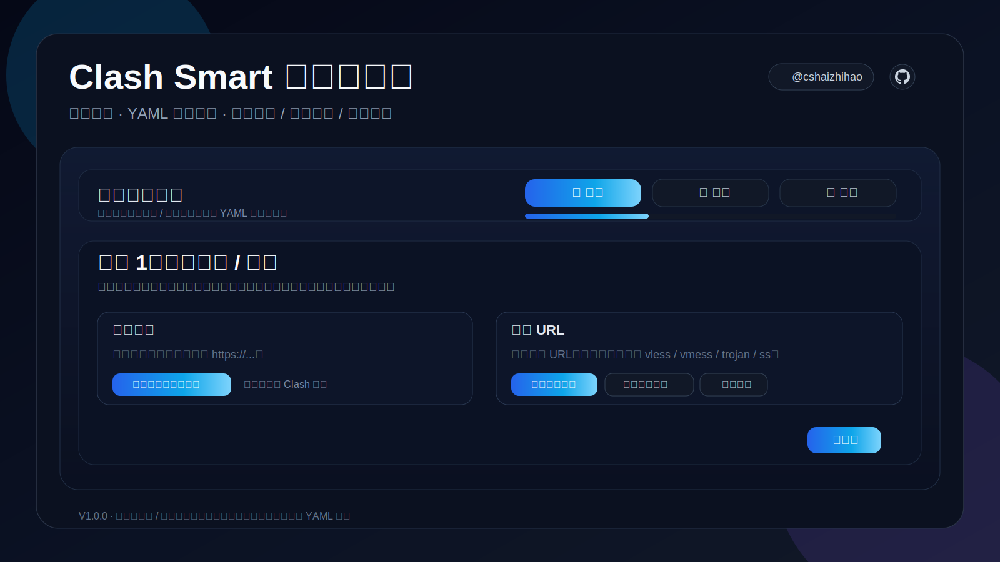

# Clash Smart 分组编辑器

> **V1.0.0** · 面向 Clash / Mihomo / OpenClash 的可视化分组与配置生成器

Clash Smart 分组编辑器专注解决一个高频问题：  
**把机场订阅、节点分组、链式代理、规则整理、YAML 交付** 这一整条链路，收敛到一个更直观的可视化工作台里。

它不是一个“什么都想做”的大而全面板，而是一个更偏**编排效率**的编辑器：

1. **导入机场订阅 / 节点**
2. **按中转组 / 落地组进行编排**
3. **生成可直接使用的 YAML 与订阅链接**

---

## 功能亮点

### 稳定的订阅导入
- 支持机场订阅链接拉取
- 支持常见节点 URL：`vless://`、`vmess://`、`trojan://`、`ss://`
- 针对部分机场做了 Clash 客户端请求头兼容
- 支持识别“占位订阅 / 非真实节点订阅”并给出明确提示

### 更顺手的分组编排
- 以 **中转组 / 落地组** 为核心使用模型
- 链式代理结果自动生成
- 支持拖拽编排
- 支持节点复用
- 支持一键分组
- 支持自动补齐默认组结构

### 完整的 YAML / 订阅交付链路
- 生成 **可直接复制的纯 YAML**
- 生成 **Clash 可用订阅链接**
- 支持打开订阅链接
- 支持下载 YAML
- 支持规则预设叠加
- 支持自动修复失效引用

### 更接近成品的 Web 体验
- 首次打开支持管理员账号初始化
- 带开屏动画与流程衔接动效
- 移动端 / 内嵌浏览器对复制链路做了降级兼容
- 页面标题、版本号、订阅链路、导出逻辑已统一

---

## 项目封面



---

## 一键安装

### 快速安装

```bash
bash -c "$(curl -fsSL https://raw.githubusercontent.com/cshaizhihao/smartclash-gen/main/install.sh)"
```

### 指定端口安装

```bash
bash -c "$(curl -fsSL https://raw.githubusercontent.com/cshaizhihao/smartclash-gen/main/install.sh)" -- --port 10801
```

### 更新已有安装

```bash
bash -c "$(curl -fsSL https://raw.githubusercontent.com/cshaizhihao/smartclash-gen/main/install.sh)" -- --update
```

---

## 安装后启动

### 启动 Web 编排台

```bash
cd ~/.smartclash-gen/web
python3 dev_server.py
```

启动后即可通过浏览器访问，并完成：
- 订阅导入
- 节点整理
- 分组编排
- 规则调整
- YAML 导出
- 订阅链接生成

---

## 命令行生成示例

### 方式 1：本地节点 URL 文件

```bash
python3 generate.py --urls urls.txt --rules rules.txt --port 7892 --output openclash.yaml
```

### 方式 2：订阅链接直接拉取

```bash
python3 generate.py \
  --sub-url "https://example.com/sub1" \
  --sub-url "https://example.com/sub2" \
  --rules rules.txt \
  --port 7892 \
  --output openclash.yaml
```

### 方式 3：订阅列表文件

```bash
python3 generate.py --sub-file subscriptions.txt --rules rules.txt --port 7892 --output openclash.yaml
```

---

## 规则预设

Web 发布页内置可叠加规则预设：

- **AI 常用**
- **流媒体常用**
- **国内直连**
- **一键叠加全部预设**
- **恢复默认规则**

预设支持：
- **叠加使用**
- **自动去重**
- **快速回到默认规则**

---

## 订阅链接说明

生成订阅链接后：
- 链接前缀会自动跟随**当前站点域名**
- 别人自行部署到自己的域名时，订阅地址也会自动跟随他们自己的站点前缀
- `/sub/latest` 返回的是标准 Clash YAML 内容，可直接用于 Clash / Mihomo / OpenClash

---

## 适用场景

这个项目更适合下面这些场景：

- 你不想手改大段 Clash YAML
- 你想把节点按中转 / 落地方式快速分组
- 你需要把配置交给别人直接导入 Clash
- 你希望把“节点导入 → 分组 → 导出”做成一个可复用流程
- 你想给自己或团队准备一个更直观的 Clash 分组编辑台

---

## 项目结构

```text
smartclash-gen/
├── generate.py          # 命令行生成入口
├── install.sh           # 安装脚本
├── VERSION              # 当前版本
├── requirements.txt     # Python 依赖
└── web/
    ├── index.html       # Web 界面
    ├── style.css        # 样式
    ├── app.js           # 前端逻辑
    └── dev_server.py    # 本地服务 / 订阅发布
```

---

## 当前版本说明

**V1.0.0** 代表本项目已经完成从“内测工具态”到“正式产品态”的第一轮收口：

- 主链路已打通
- 订阅拉取已做真实兼容修复
- YAML 导出可直接使用
- 订阅链接可生成、打开、复制
- Web 页面已完成一轮产品化 polish
- 安装脚本已完成中文化与端口选择优化

---

## License

MIT
